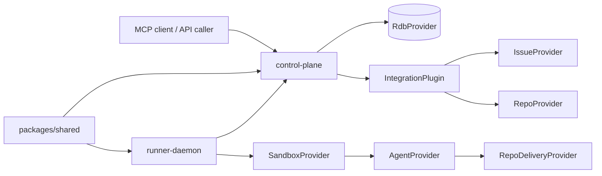

# Mystra

> Orchestration of the coding agents, for the coding agents, by the coding agents.

Mystra is an open-source coding-agent orchestration platform.

It provides a headless control plane for submitting work through HTTP, CLI or MCP,
a local-first persistence layer, pluggable Issue/runtime/repository seams, and
pull-based runners that execute agents in sandboxes and return structured review
handoffs.

Mystra uses [Open Agents](https://github.com/vercel-labs/open-agents) as a
**source-authoritative baseline and reference architecture**, while keeping
Mystra-owned interfaces at provider and execution seams.

## Current status

Mystra is in active MVP development.

Today the repository is focused on proving a local-first path with:

- a Next.js control plane
- SQLite behind `RdbProvider`
- GitHub `RepoProvider` + repository-scoped `IssueProvider`, and read-only
  Linear `IssueProvider`, behind composable Integrations
- a pull-based runner daemon
- direct Job/Run → Sandbox → Agent execution
- repository delivery for GitLab and GitHub
- agent execution through current provider adapters

The MVP is primarily for self-use. The long-term direction is to provide a
developer experience similar in spirit to **Stripe Minion**: fast Issue intake,
clear execution ownership, reviewable outputs, and strong platform boundaries
between runtime, agent and repository delivery. Optional orchestration may return
later as an agent hook plugin; it is not an active runtime dependency.

## Why Mystra exists

Mystra is designed for teams that want a platform-shaped way to run coding agents on infrastructure they control, while preserving clean contracts between:

- control plane and runner
- Issue intake and persistence
- sandbox runtime and agent adapters
- platform capabilities and project-specific configuration

The architecture should remain **headless by default**: Mystra should have a first-class single-node shape, and later grow into a **shared-nothing clustered architecture** without redefining the product model. The same control-plane and runner contracts should survive the move from one local machine to remote hosts and pooled execution.

This makes Mystra closer to a **control-plane-and-runner system** in the Jenkins / Salt / Nomad family than to a pure file-driven local tool. Declarative project or template configuration may grow over time, but Mystra still needs durable execution truth for jobs, runs, and repository artifacts.

The long-term direction is a hosted **Mystra platform** that serves many **Teams**
and projects, each with its own runtime and agent configuration, while sharing
platform-owned provider pools. A workspace is run-scoped execution storage, not
tenancy.

## Architecture at a glance

```text
apps/control-plane    Next.js route handlers, state-facing APIs, MCP endpoint
apps/runner-daemon    Pull-based runner service
packages/shared       Zod schemas, state machine, events, result contracts
packages/agent-adapters
plugins/mystra
plugins/supabase
supabase
```



### Provider seams

| Provider | Current implementation | Direction |
|---|---|---|
| `RdbProvider` | SQLite | Hosted/cloud RDB later |
| `IntegrationPlugin` | GitHub and Linear | Additional capability compositions later |
| `RepoProvider` | GitHub remote repository discovery | GitLab and other repository integrations later |
| `IssueProvider` | GitHub repository-scoped; Linear read-only | Additional issue integrations later |
| `SandboxProvider` | Local sandbox path | Stronger isolation / cloud sandbox later |
| `RepoDeliveryProvider` | GitHub and GitLab | Additional delivery hosts or variants later |
| `AgentProvider` | Current agent adapters | Additional agent providers later |

## Quick start

### Prerequisites

- Node.js 24.x
- pnpm

### Install and verify

```sh
pnpm install
pnpm build
pnpm typecheck
pnpm test
```

### Start the local loop

Start the control plane:

```sh
pnpm dev:control-plane
```

Start a local runner in another terminal:

```sh
MYSTRA_CONTROL_PLANE_URL=http://localhost:3000 pnpm dev:runner
```

If you want the shortest operator path on this machine, use:

```sh
./scripts/start-local.sh
pnpm run doctor
```

For a full local protocol walk, MCP examples, restart-durability checks, and development-machine deployment notes, see [docs/LOCAL-USAGE.md](docs/LOCAL-USAGE.md).

## Core commands

| Command | Description |
|---|---|
| `pnpm build` | Build all packages/apps |
| `pnpm typecheck` | Run TypeScript checks across the repo |
| `pnpm lint` | Run repo lint/type lint commands |
| `pnpm test` | Run the test suite |
| `pnpm doctor` | Run local preflight checks |
| `pnpm dev:control-plane` | Start the control plane |
| `pnpm dev:runner` | Start the local runner |
| `pnpm lsp:typescript` | Start the repo-local TypeScript language server |
| `pnpm run deploy:dev` | Deploy to the configured development machine |
| `pnpm job:submit -- ...` | Submit a project-backed job |
| `pnpm preview -- list` | Inspect retained preview environments |

## Code navigation

- Use `pnpm lsp:typescript` for TypeScript symbol-local questions such as
  definitions, references, diagnostics, and rename preparation.
- Use GitNexus for graph-aware questions such as execution flow, impacted
  callers, and blast radius.
- Use both together when you start from one symbol and then need to understand
  wider repository behavior.

## MVP scope

### In scope

- control-plane APIs and MCP entrypoint
- pull-based runner registration and job claim loop
- structured lifecycle events and final results
- project-scoped runtime configuration
- repository review delivery
- provider seams that keep local-first and future hosted implementations replaceable

### Out of scope

- control-plane caller authentication
- logs API or log persistence
- retry API
- callback URLs
- quality-gate fix loops
- per-repository secret management
- Kubernetes sandbox workloads
- hosted cloud RDB implementation

## Documentation map

- [docs/LOCAL-USAGE.md](docs/LOCAL-USAGE.md) — local usage, smoke paths, and operator runbook
- [docs/DEMO-FLOW.md](docs/DEMO-FLOW.md) — live demo script and capability-tour framing
- [docs/ARCHITECTURE.md](docs/ARCHITECTURE.md) — system architecture notes
- [docs/SPEC.md](docs/SPEC.md) — product and engineering boundaries
- [docs/IMPLEMENTATION-PLAN.md](docs/IMPLEMENTATION-PLAN.md) — phased implementation plan
- [docs/repoindex/overview.md](docs/repoindex/overview.md) — repository overview for brownfield onboarding
- [docs/ADR-0001-control-plane-runner.md](docs/ADR-0001-control-plane-runner.md) through [docs/ADR-0005-open-agents-source-baseline.md](docs/ADR-0005-open-agents-source-baseline.md) — architecture decision records

## Project context

Mystra keeps durable repository context in the 5xP files:

- [PRODUCT.md](PRODUCT.md)
- [PLATFORM.md](PLATFORM.md)
- [PROCESS.md](PROCESS.md)
- [PROFILE.md](PROFILE.md)
- [AGENTS.md](AGENTS.md)

These files describe product boundaries, platform constraints, development-process rules, and agent-facing repository conventions.

## Contributing

See [CONTRIBUTING.md](CONTRIBUTING.md).

In short:

1. Fork the repository.
2. Create a branch from `main`.
3. Make a focused change.
4. Run `pnpm typecheck && pnpm test`.
5. Open a pull request that explains the motivation and scope.

## License

[MIT](LICENSE)
