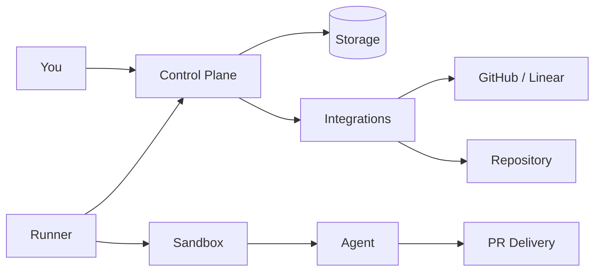

<p align="center">
  
</p>

# Mystra

> Ship software with agents.

Describe what you want to build. Mystra turns it into working software —
planning, implementation, testing, and delivery handled by agents autonomously.

Tools that turn ideas into code already exist. But they produce prototypes, not
production software — no tests, no review, no maintainable architecture. Mystra
targets serious delivery: agents run the full SDLC and produce results you can
ship.

Open-source. Self-hostable or hosted.

## How it works

```text
Idea → Task → Agent Session → Tests & Review → Pull Request
```

1. **Describe your intent.** Submit through API, CLI, MCP, or the web interface.
2. **Agents execute.** A sandboxed agent handles planning, implementation, testing, and branch delivery.
3. **Review and ship.** You get a pull request with tested, reviewable code — ready to merge.

## Status

Mystra is in active development. The current release proves the full loop on a
single node: task intake, sandboxed agent execution, and PR delivery with
GitHub and Linear as issue sources.

## Architecture



Mystra separates concerns through provider interfaces — swap storage, sandbox,
agent, or delivery implementations without changing the core model.

| Layer | Current | Extensible to |
|---|---|---|
| Storage | SQLite | Postgres, hosted RDB |
| Issues | GitHub, Linear | Jira, custom |
| Sandbox | Docker (local) | Cloud sandbox, Kubernetes |
| Agent | Direct execution | Any coding agent |
| Delivery | GitHub, GitLab | Additional hosts |

## Quick start

```sh
# Prerequisites: Node.js 24.x, pnpm
pnpm install && pnpm build

# Start the control plane
pnpm dev:control-plane

# Start a runner (separate terminal)
pnpm dev:runner
```

Or use the one-liner:

```sh
./scripts/start-local.sh
```

See [docs/LOCAL-USAGE.md](docs/LOCAL-USAGE.md) for the full walkthrough.

## Commands

| Command | Description |
|---|---|
| `pnpm build` | Build all packages |
| `pnpm test` | Run tests |
| `pnpm typecheck` | TypeScript checks |
| `pnpm dev:control-plane` | Start control plane |
| `pnpm dev:runner` | Start runner |
| `pnpm doctor` | Local preflight checks |

## Documentation

- [docs/LOCAL-USAGE.md](docs/LOCAL-USAGE.md) — local usage and operator runbook
- [docs/ARCHITECTURE.md](docs/ARCHITECTURE.md) — system architecture
- [docs/DEMO-FLOW.md](docs/DEMO-FLOW.md) — demo walkthrough

## Contributing

See [CONTRIBUTING.md](CONTRIBUTING.md).

## License

[MIT](LICENSE)
