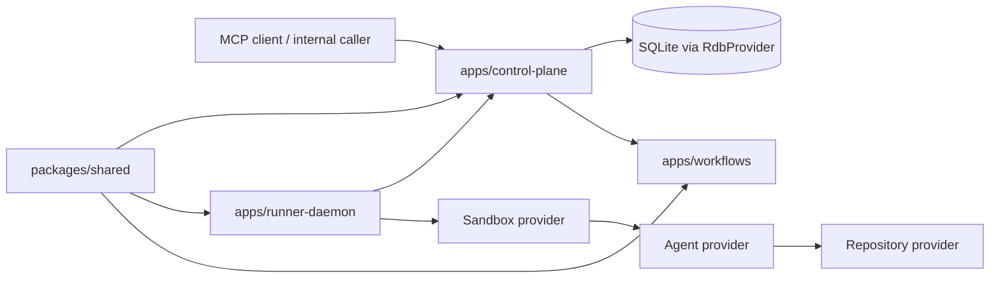

# Mystra Repoindex Overview

## What repoindex is

`repoindex` is the repository-indexing workflow Mystra uses for brownfield understanding.
In this repository, it is intentionally **GitNexus-first** and **5xP-aware**:

1. **GitNexus** provides the current structural view of the codebase.
2. **5xP files** (`AGENTS.md`, `PRODUCT.md`, `PLATFORM.md`, `PROCESS.md`, `PROFILE.md`) provide durable product and process context.
3. Durable docs such as `docs/ARCHITECTURE.md`, `docs/LOCAL-USAGE.md`, and `specs/spec-status.md` fill in runtime and status details.

This means repoindex is not a blind directory walk. It is a maintained onboarding and architecture snapshot for the current repository state.

## Purpose

Mystra is a self-use coding-agent orchestration platform. Its current MVP lets internal callers or remote MCP clients submit implementation work for repositories, then routes that work through a control plane, runner, sandbox, and agent so the platform can produce a reviewable branch and repository review artifact.

Architecturally, Mystra is a **headless control-plane-and-runner system**. It is closer to Jenkins / Salt / Nomad than to a pure file-driven local tool: the product may use more declarative project/runtime/template inputs over time, but it still needs durable execution truth for tasks, runs, events, and artifacts.

The near-term goal is one self-use, local-first path that works end to end. The north-star direction is a hosted **Mystra platform** serving many **workspaces** and **projects** without rewriting core contracts, with a developer experience similar in spirit to Stripe Minion.

The deployment path should stay **single-node first** and later expand into a **shared-nothing clustered** form where practical. In this repository, shared-nothing refers to minimizing shared mutable hot-path state, not to eliminating durable state entirely.

### Explicit MVP exclusions

Current MVP scope intentionally excludes:

- control-plane caller authentication
- logs API or log persistence
- retry API
- callback URLs
- quality-gate fix loops
- Claude CLI adapter
- Kubernetes sandbox workloads
- cross-runner shared caches
- per-repository secret management
- hosted PG/Supabase RDB implementation

## Runtime shape

Mystra is a TypeScript pnpm monorepo.

```text
apps/control-plane    Next.js control plane, HTTP APIs, MCP endpoint
apps/workflows        Workflow provider implementations and orchestration adapters
apps/runner-daemon    Pull-based runner service
packages/shared       Shared Zod schemas, state machine, events, results
packages/agent-adapters
plugins/supabase
supabase
```

### Primary stack

- TypeScript 5.9
- pnpm monorepo
- Next.js 16 route handlers
- React 19
- Zod 4
- Vitest 4
- SQLite first, behind `RdbProvider`
- Sandbox provider
- Agent provider
- Repository provider

### Architectural direction

- Open Agents is a **source-authoritative baseline**, not a packaged SDK dependency that Mystra blindly imports.
- Mystra owns its provider and orchestration seams.
- The first durable state source is SQLite.
- The local workflow implementation handles orchestration, not business storage.
- Runner hosts only initiate outbound connections.
- Project, runtime, and template inputs should resolve into immutable execution contracts before runner-side execution.
- Shared-nothing is a scaling direction for hot-path coordination; tasks, runs, events, results, and artifacts still need durable truth.

## Main workflows

### 1. Submit work through HTTP or remote MCP

An internal caller or agent creates a Project and submits a task through the control plane HTTP APIs or `/api/mcp`. The control plane validates schemas, persists Project/task/run state, and starts the configured workflow path.

### 2. Runner claim and execution

The `runner-daemon` long-polls the control plane for assignable tasks, receives a resolved runtime contract, prepares the execution environment, then runs the task in the configured sandbox with the selected agent provider.

### 3. Workflow execution and delivery

Mystra provides workflow execution rather than one fixed delivery sequence. The control plane resolves the configured workflow and runtime contract, the runner executes that workflow inside the selected sandbox, and the resulting branch or repository review artifact depends on the workflow logic in use. The current workflow implementation is only a simple example, not the long-term product contract.

### 4. Health, inspection, and preview

Operators inspect health through `mystra_health`, task APIs, and preview helpers. Mystra keeps enough structured state in the database that task/run lifecycle can be explained without depending on transient container logs alone.

## Top-level topology



## Operator commands

### Core commands

```sh
pnpm install
pnpm build
pnpm typecheck
pnpm lint
pnpm test
pnpm doctor
pnpm dev
pnpm dev:control-plane
pnpm dev:runner
```

### High-value focused commands

```sh
pnpm --filter @mystra/shared test
pnpm --filter @mystra/runner-daemon test
pnpm --filter @mystra/control-plane dev
pnpm run deploy:dev
pnpm job:submit -- --project <slug> --task-id <id> ...
pnpm preview -- list
pnpm preview -- logs mystra-<run-id>
pnpm preview -- quality mystra-<run-id>
```

## Current status snapshot

### Spec-Kit

`specs/spec-status.md` currently shows all listed features as complete:

- 001 through 012 are marked complete in the current status artifact
- the tracked feature set is fully backfilled into Spec-Kit format

### GitNexus

GitNexus was refreshed before this overview, and the current repository graph was used as structural evidence. The exact graph counts are intentionally omitted because they are volatile index metadata rather than durable project facts.

## Important constraints

- `Project.runtime.image` is the runtime image contract; there is no top-level compatibility `Project.image` field.
- `TaskSpec` carries task identity and limited runtime overrides, not platform capability declarations.
- Runner claim responses return a resolved runtime contract, and the runner executes that contract rather than independently interpreting Project state.
- Sandbox task environments must not receive platform-breaking host access.
- Secrets must be injected at runtime through env vars or read-only files.
- Provider implementations must remain replaceable behind Mystra-owned seams.

## Where to read next

For the fastest onboarding path, read these in order:

1. `PRODUCT.md`
2. `PLATFORM.md`
3. `PROCESS.md`
4. `docs/ARCHITECTURE.md`
5. `docs/LOCAL-USAGE.md`
6. `docs/IMPLEMENTATION-PLAN.md`
7. `specs/spec-status.md`

## Provenance

This overview is grounded in:

- GitNexus index status and current repository graph
- `PRODUCT.md`
- `PLATFORM.md`
- `PROCESS.md`
- `AGENTS.md`
- `docs/ARCHITECTURE.md`
- `docs/LOCAL-USAGE.md`
- `docs/IMPLEMENTATION-PLAN.md`
- `specs/spec-status.md`
