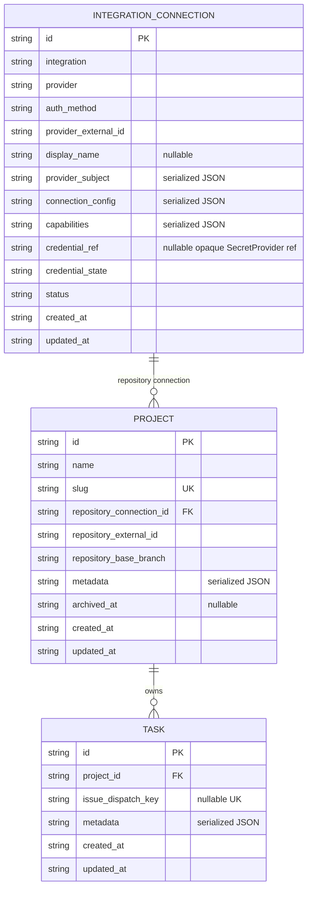

# 数据模型：Prisma 多数据库 RDB

**Status**: Owner approved
**Audited baseline**: merged `main@10750ca`（包含 039 与 041）
**Audited on**: 2026-08-06
**Current-schema coverage**: 当前 schema 的 84 个业务列已完成 84/84 审计；根据 Owner 最新反馈，
Prisma 第一期候选模型收缩为 3 张业务表、30 个候选字段。

## 第四轮结论

Prisma 第一期只管理以下 3 张 Mystra 业务表：

1. `integration_connections`
2. `projects`
3. `tasks`

不建立 `integration_connection_capabilities` 联动表。`IntegrationConnection` 使用一个
`capabilities` JSON 字段保存零到多个能力配置；该字段在持久化边界由 Zod 校验，数据库只负责原子保存。

不进入第一期 Prisma schema 的现有表：

- `context_bundles`：现有 ContextBundle 领域模型、catalog 和 CRUD 均待重新设计。
- `sessions`：Session persistence、状态机、结果、取消、Runtime/Agent/branch ownership 与 Task relation
  整体待后续规格重新设计；第一期不保留任何 Session 字段或 CRUD。
- `runners`：现有 Runner 持久化、身份、心跳、容量和 Session assignment 模型均待
  `042-runtime-sandbox-capacity` 后续设计。
- `session_events`：已取消 workflow 设计留下的内部事件表。
- `artifacts`：现有表没有独立读取合同；未来 Artifact 需要单独规格。
- `mystra_schema`：由 Prisma `_prisma_migrations` 取代。

`_prisma_migrations` 是 Prisma 管理元数据，不是 Mystra 业务实体，因此不画入 ER 图。

## 为什么选择一个 capabilities JSON

候选方案比较：

| 方案 | 结论 | 原因 |
|---|---|---|
| 每个 capability 一列 JSON | 不采用 | 新增 `issues`、`ci`、`deployments` 等能力仍需 schema migration；列会快速稀疏。 |
| Connection + capability 子表 | 暂不采用 | 当前没有独立查询、独立生命周期、独立 credential 或高并发分模块更新需求，规范化收益不足。 |
| Connection 上一个 `capabilities` JSON | **采用** | 不新增联动表；新增 capability key 不需要数据库 migration；整个连接配置可原子读写。 |

接受的代价：capability 不能依赖普通关系索引进行复杂查询，多个调用者并发修改不同 capability 时仍是
整份对象写入。当前管理面由单一 Connection service 持有写权限，因此先保持简单；若未来出现独立生命周期、
高并发更新或跨 Connection capability 查询，再通过独立 Spec 规范化。数据库没有必要提前表演企业架构。

### `capabilities` JSON 合同

```json
{
  "repositories": {
    "state": "enabled",
    "config": {
      "selection": "selected"
    },
    "permissions": {
      "contents": "write"
    },
    "accessSummary": {
      "repositoryCount": 3
    },
    "verifiedAt": "2026-08-06T08:00:00.000Z"
  },
  "issues": {
    "state": "enabled",
    "config": {},
    "permissions": {},
    "accessSummary": {},
    "verifiedAt": null
  }
}
```

每个 capability entry 都使用相同 envelope：

| 字段 | 必填 | 类型/枚举 | 作用 |
|---|---:|---|---|
| `state` | 是 | `enabled \| disabled \| unavailable` | `enabled` 可使用；`disabled` 被操作者关闭；`unavailable` 表示 adapter 支持但当前凭据或配置不可用。 |
| `config` | 是 | JSON object | capability-specific 非秘密配置，例如 repository selection、Linear team scope、Jenkins job scope。 |
| `permissions` | 是 | JSON object | Provider 返回的授权摘要，不复制 token。 |
| `accessSummary` | 是 | JSON object | 脱敏后的可访问资源摘要，用于管理面说明连接覆盖范围。 |
| `verifiedAt` | 是 | ISO-8601 string 或 `null` | 最近一次由 Provider 实际验证该能力的时间。 |

Capability key 使用可扩展的 kebab-case string，不是数据库 enum。当前实现只允许 plugin 声明的 key；
已知方向包括 `repositories`、`issues`、`change-requests`、`code-reviews`、`ci`、`deployments`。
缺少某个 key 表示该 Connection 没有声明该能力，不等同于 `unavailable`。

GitHub `repositories.config.selection` 当前允许：

- `all`：GitHub App 安装授权全部 repositories。
- `selected`：GitHub App 安装只授权选定 repositories。
- `token`：PAT 可见范围由 token 权限决定。

## 命名规则

- Prisma model 使用单数 PascalCase；物理表使用复数 `snake_case` 并通过 `@@map` 映射。
- Prisma field 使用 `camelCase`；物理列使用 `snake_case` 并通过 `@map` 映射。
- 属于另一个业务对象或领域的配置字段必须带该领域前缀。例如 Project 的 base branch 必须命名为
  `repository_base_branch`，不能用失去上下文的 `base_branch`。
- API、MCP、CLI 与 `RdbProvider` 返回 Mystra-owned Zod/domain types；Prisma generated types 不越过
  persistence boundary。
- ID 由领域层生成 UUID string；SQLite 与 PostgreSQL 均不改为自增 ID。
- 时间保存 ISO-8601 string；结构化对象保存为经过 Zod 验证的 serialized JSON string，以保持
  SQLite/PostgreSQL provider parity。本期不需要 JSON path 查询。

## 命名与删除审计

| 当前名称 | 第一期决定 | 结论 |
|---|---|---|
| `integration_connections.external_id` | `provider_external_id` | Provider identity，不应伪装成公共业务 ID。 |
| `integration_connections.connection_type` | `auth_method` | Provider-defined 认证方式，不固化为 GitHub App/PAT 数据库 enum。 |
| `integration_connections.account` | `provider_subject` | 授权主体可能是 user、organization、workspace、server instance 或 service account。 |
| 无 | `integration_connections.connection_config` | 新增 connection-level 非秘密配置，例如 endpoint、region、API version。 |
| `repository_selection`、`permissions`、`access_summary` | 合并到 `capabilities` | capability-specific 数据不再作为 Connection 顶层必填列。 |
| `projects.base_branch` | `repository_base_branch` | 遵守领域前缀规范。 |
| `projects.repository_snapshot` | `repository_external_id` | Project 只保存稳定仓库身份；名称、URL、默认分支、可见性和归档状态不进入本期 RDB。Repo Info 获取与缓存另行设计。 |
| `projects.default_agent` | 删除 | Project execution default 待重新设计。 |
| `projects.runtime` / 候选 `runtime_config` | 删除 | Project Runtime/Sandbox 配置待重新设计。 |
| `projects.prewarm_config` | 删除 | Prewarm 所有权与生命周期待重新设计。 |
| `tasks.source` | 删除 | Task 来源分类等待 Linear/Issue Integration 规格重新设计。 |
| `tasks.objective` | 删除 | Task intent payload 等待后续 Task/Integration 规格重新设计。 |
| `tasks.issue_snapshot` | 删除 | Issue 当前信息未来走 Integration/cache 设计；040 不保存 snapshot，也不实现 cache。 |
| `tasks.repository_snapshot` | 删除 | Repository 当前信息未来走 Integration/cache 设计；040 不保存 snapshot，也不实现 cache。 |
| `tasks.dispatch_key` | `issue_dispatch_key` | 幂等键属于 Issue dispatch，必须带 `issue_` 领域前缀。 |
| `context_bundles` | 删除 | Context delivery 模型整体待重新设计。 |
| `sessions` | 删除 | Session persistence 与所有字段/CRUD 整体延后，不在 040 选择字段或命名。 |
| `runners` | 删除 | Runner/Runtime/connector 模型整体待重新设计。 |
| `CoordinationSessionSummary` 及 route/MCP | 删除 | workflow/event-derived 投影，不迁移为 Session 字段。 |
| `ExecutionContractReference.artifactId` | 删除 | Artifact 实体删除后不保留替代 ID。 |
| `ExecutionSpecArtifact` | `ExecutionSpecSnapshot` | 保留 Session-owned frozen inline snapshot，不再伪装成 Artifact 实体。 |

## ER 图



## 逐字段审批结构

### 1. `integration_connections`

Prisma model: `IntegrationConnection`；14 个业务字段。

| 物理字段 | Nullable | 类型/枚举 | 作用 |
|---|---:|---|---|
| `id` | 否 | UUID string | Mystra 内部稳定 Connection ID。 |
| `integration` | 否 | extensible key string | Integration plugin 产品族，例如 `github`、`linear`、`jenkins`。不是数据库 enum。 |
| `provider` | 否 | extensible key string | 具体 adapter/service variant，例如未来的 GitHub Cloud 或 GitHub Enterprise adapter。不是数据库 enum。 |
| `auth_method` | 否 | provider-defined key string | 认证方式，例如 `github-app`、`personal-access-token`、`oauth`、`api-token`、`service-account`。由 adapter Zod schema 限定，不是数据库 enum。 |
| `provider_external_id` | 否 | string | Provider 侧稳定身份；GitHub App 使用 installation id，PAT 当前使用不可逆 token fingerprint。 |
| `display_name` | 是 | string | 操作者可独立编辑的连接名称；`null` 表示使用 Provider 主体信息作为默认展示，不参与 provider identity。 |
| `provider_subject` | 否 | JSON object | 被授权主体的非秘密快照，例如 external id、login/name、subject type、avatar URL。 |
| `connection_config` | 否 | JSON object，默认 `{}` | Connection-level 非秘密配置，例如 endpoint、region、tenant、API version。不得放 capability 配置或凭据。 |
| `capabilities` | 否 | JSON object，默认 `{}` | 以 capability key 为键保存上文统一 envelope；新增 capability 不需要数据库 migration。 |
| `credential_ref` | 是 | opaque string | 指向 `SecretProvider` 的不透明引用；永不保存明文 credential。某些 hosted 连接没有 connection-owned secret。 |
| `credential_state` | 否 | `ready \| missing \| invalid` | `ready` 可解析；`missing` 引用不存在/未配置；`invalid` 已验证为无效。 |
| `status` | 否 | `active \| inactive` | Connection 是否允许被新的业务操作选择；不代表每项 capability 都可用。 |
| `created_at` | 否 | ISO-8601 string | 创建时间。 |
| `updated_at` | 否 | ISO-8601 string | Connection 任一持久字段最后更新时间。 |

约束：

- PK：`id`。
- Unique：`(integration, provider, provider_external_id)`。`provider_external_id` 只保证在具体 provider
  namespace 内稳定；不同 adapter/service variant 不得互相占用 identity。
- Index：`(integration, status)`、`(created_at, id)`。
- Project repository 绑定必须同时满足 Connection `status=active`、`credential_state=ready`，并且
  `capabilities.repositories.state=enabled`；该复合业务不变量由 Connection/Project service 校验。
- Capability 没有独立表、ID、credential 或 CRUD；创建/更新 Connection 时原子校验并保存整个对象。
- `display_name` 可独立更新或清空为 `null`，不得要求同时替换 credential、capabilities 或 provider identity。

### 2. `projects`

Prisma model: `Project`；10 个业务字段。

| 物理字段 | Nullable | 类型/枚举 | 作用 |
|---|---:|---|---|
| `id` | 否 | UUID string | Project 稳定 ID。 |
| `name` | 否 | string | 面向操作者的 Project 名称。 |
| `slug` | 否 | slug string | URL、CLI 与 MCP 使用的稳定可读标识。 |
| `repository_connection_id` | 否 | UUID FK | 精确绑定用于 repository discovery/delivery 的 IntegrationConnection。 |
| `repository_external_id` | 否 | provider-defined opaque string | Provider 侧稳定 Repository identity；与 `repository_connection_id` 共同定位仓库，不因 rename 改写。不是数据库 enum，也不是可读仓库名。 |
| `repository_base_branch` | 否 | string | Mystra 对该 Project 实际使用的 repository base branch；它是用户配置，不是 Provider 当前 default branch 的镜像。 |
| `metadata` | 否 | JSON object，默认 `{}` | 非核心、非秘密扩展元数据；不得承载 Agent、Runtime、Prewarm 或 credential 配置。 |
| `archived_at` | 是 | ISO-8601 string | 非空表示已归档；默认 list 不返回归档 Project。 |
| `created_at` | 否 | ISO-8601 string | 创建时间。 |
| `updated_at` | 否 | ISO-8601 string | 最后更新时间。 |

约束：

- PK：`id`；Unique：`slug`。
- `repository_connection_id` FK 到 `integration_connections.id`，`ON DELETE RESTRICT`。
- `(repository_connection_id, repository_external_id)` 是不可变 Repository binding；仓库改名不更新
  Project。更换仓库需要新建 Project，不通过普通 update 偷换历史语义。
- Project 不保存 repository 名称、URL、clone URL、Provider default branch、visibility、archive/delete
  状态或 `fetchedAt`。040 不负责这些 Repo Info 的查询、缓存、失效或展示方案。
- `default_agent`、`runtime_config`、`prewarm_config` 不进入第一期 schema，也不得藏入 `metadata`。

### 3. `tasks`

Prisma model: `Task`；6 个业务字段。

| 物理字段 | Nullable | 类型/枚举 | 作用 |
|---|---:|---|---|
| `id` | 否 | UUID string | Task 稳定 ID。 |
| `project_id` | 否 | UUID FK | Task 所属 Project。 |
| `issue_dispatch_key` | 是 | string | Issue dispatch 幂等键；带 Issue 领域前缀，不承载 Issue 内容。 |
| `metadata` | 否 | JSON object，默认 `{}` | 非核心、非秘密 Task 扩展元数据。 |
| `created_at` | 否 | ISO-8601 string | 创建时间。 |
| `updated_at` | 否 | ISO-8601 string | 最后更新时间。 |

约束：

- PK：`id`；`project_id` FK 到 `projects.id`，`ON DELETE RESTRICT`。
- Nullable Unique：`issue_dispatch_key`；Index：`project_id`、`(created_at, id)`。
- Task 不保存 source、objective、Issue/Repository snapshot、Session state/result、Agent 或 Runtime。
- Issue/Repository 当前信息的 cache key、payload、TTL、刷新与失效合同由后续 Integration 规格定义；
  040 不实现 cache，也不得把删除的 snapshot 偷放进 `metadata`。
- Task 不提供 generic update/delete。

## CRUD / command 覆盖矩阵

“全部 CRUD 接 Prisma”表示上述三张表的全部 RDB 读写只能经 `PrismaRdbProvider` 与 Prisma Client；
不意味着向外提供无约束的通用表管理 API。

| Entity | Prisma-backed 操作 | 明确不提供 |
|---|---|---|
| IntegrationConnection | create/upsert、replace、get、list、display-name update/clear、status update、capabilities 原子更新、delete、list bound Projects | capability 子表 CRUD、明文 credential、通用 JSON path query |
| Project | create、get by id/slug、list、metadata update、base-branch update、archive | Repo Info 查询/缓存 CRUD、hard delete、Agent/Runtime/Prewarm 配置 CRUD |
| Task | create、Issue dispatch idempotent upsert/read、get、list | generic update/delete、source/objective/snapshot、execution state、Session relation projection |

不进入 Prisma 第一期的现有 CRUD/接口必须显式移除或返回稳定的 unavailable/deferred 结果，不能继续
通过 `better-sqlite3` 或 raw SQL 暗中运行：

- ContextBundle create/get/list/update/archive。
- Session create/get/list/state/result/cancel/complete/stale/assignment 与 Task child-Session projection。
- Runner register/authenticate/heartbeat/list/credential rotation/claim assignment。
- SessionEvent append/list、Artifact create/list、CoordinationSessionSummary。

Runtime 业务路径禁止使用 `$queryRaw`、`$executeRaw`、`pg.query` 或直接 `better-sqlite3` 执行业务 CRUD。
Prisma Migrate 生成的 migration SQL 与旧 SQLite 接管前只读 schema fingerprint 不属于运行时业务 CRUD。

## Provider parity

SQLite 与 PostgreSQL 使用独立 datasource、client 与 migration history，但必须保证：

- 三个 model 的 field、table/column map、nullability、relation 与 referential action 一致。
- enum value、unique/index、排序和错误语义一致。
- `capabilities` 在两库都作为经过 Zod 校验的 serialized JSON string 原子读写。
- Project 在两库都只保存 stable Repository binding；Repo Info 获取与缓存不属于 040 provider parity。
- 同一 provider contract suite 在 SQLite 与真实 PostgreSQL 上通过。
- Supabase 复用 PostgreSQL schema/client/provider，只改变连接 profile。

允许差异仅包括 datasource provider、generator output、底层 migration SQL、SQLite pragmas 和
PostgreSQL connection/pool configuration。

## Owner approval record

Owner 已批准以下第四轮 ER 决定，并要求进入开发：

1. `integration_connections.capabilities` 使用单一动态 JSON，不建立 capability 子表，也不按能力加列。
2. Prisma 第一期采用上述 3 张、30 字段模型。
3. Project 使用 `repository_base_branch`，并删除 `default_agent`、`runtime_config`、`prewarm_config`。
4. 已批准：Project 删除 `repository_snapshot`，改存 `repository_external_id`；Task 删除 `source`、
   `objective`、`issue_snapshot`、`repository_snapshot`，并将 `dispatch_key` 改名为
   `issue_dispatch_key`。Issue/Repository cache 由后续 Integration 规格设计，不属于 040。
5. 已批准：`sessions` 整表及全部关系/CRUD 退出 040，后续重新设计；不保留旧 SQL 路径。
6. 删除 `context_bundles`、`runners`；对应 CRUD 不在旧 SQL 路径继续存活。
7. 已批准项保持不变：保留 `projects.repository_connection_id`；删除 `session_events`、`artifacts`、
   `mystra_schema`、event-derived summary 和 `artifactId`。

批准记录：2026-08-06。后续实现若改变三表、30 字段、关系、枚举或明确删除面，必须重新提交 Owner
审批；实现任务和代码不得自行扩表。
