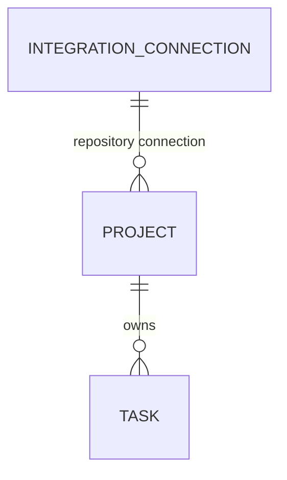

# ER 审批面

本功能没有 UI prototype。此页用于 Owner 审批 Prisma 第一期数据模型；完整约束与 JSON envelope
以 [`data-model.md`](./data-model.md) 为唯一事实来源。

## 本期范围

- 3 张业务表，30 个字段：IntegrationConnection 14、Project 10、Task 6。
- `sessions` 整表、Task-to-Session 关系、Session 状态机与 CRUD 全部延期。
- `context_bundles`、`runners`、`session_events`、`artifacts`、`mystra_schema` 不进入新 schema。
- Repo Info 查询、缓存、TTL、刷新与失效不属于 040。

## IntegrationConnection（14）

| 字段 | Null | 类型/枚举 | 作用 |
|---|---:|---|---|
| `id` | 否 | UUID string | Mystra 内部稳定 Connection ID。 |
| `integration` | 否 | extensible key | Integration plugin 产品族，例如 GitHub、Linear、Jenkins。 |
| `provider` | 否 | extensible key | 具体 adapter/service variant。 |
| `auth_method` | 否 | provider-defined key | 认证方式；由 adapter Zod schema 限定，不是数据库 enum。 |
| `provider_external_id` | 否 | string | Provider 侧稳定连接身份。 |
| `display_name` | 是 | string | 操作者可独立编辑或清空的显示名称；`null` 使用 Provider 主体信息展示，不参与身份判断。 |
| `provider_subject` | 否 | JSON object | 被授权主体的非秘密快照。 |
| `connection_config` | 否 | JSON object | Connection-level 非秘密配置。 |
| `capabilities` | 否 | JSON object | 零到多个 capability envelope 的原子映射。 |
| `credential_ref` | 是 | opaque string | 指向 SecretProvider 的不透明引用。 |
| `credential_state` | 否 | `ready \| missing \| invalid` | credential 的可解析/缺失/无效状态。 |
| `status` | 否 | `active \| inactive` | 是否允许新的业务操作选择该 Connection。 |
| `created_at` | 否 | ISO-8601 string | 创建时间。 |
| `updated_at` | 否 | ISO-8601 string | 最后更新时间。 |

Capability entry 统一为 `state/config/permissions/accessSummary/verifiedAt`；`state` 枚举为
`enabled | disabled | unavailable`。Capability key 是 plugin-declared string，不是数据库 enum。
Connection identity 唯一键为 `(integration, provider, provider_external_id)`。

## Project（10）

| 字段 | Null | 类型/枚举 | 作用 |
|---|---:|---|---|
| `id` | 否 | UUID string | Project 稳定 ID。 |
| `name` | 否 | string | 面向操作者的名称。 |
| `slug` | 否 | slug string | URL、CLI 与 MCP 使用的稳定可读标识。 |
| `repository_connection_id` | 否 | UUID FK | 精确绑定 repository IntegrationConnection。 |
| `repository_external_id` | 否 | opaque string | Provider 侧稳定 Repository identity，不因 rename 改写。 |
| `repository_base_branch` | 否 | string | Mystra 对该 Project 使用的 repository base branch。 |
| `metadata` | 否 | JSON object | 非核心、非秘密扩展元数据。 |
| `archived_at` | 是 | ISO-8601 string | 非空表示 Project 已归档。 |
| `created_at` | 否 | ISO-8601 string | 创建时间。 |
| `updated_at` | 否 | ISO-8601 string | 最后更新时间。 |

Project 不保存 Repository 名称、URL、clone URL、Provider default branch、visibility、archive/delete
状态或 fetchedAt；也不保存 Agent、Runtime、Prewarm 配置。

## Task（6）

| 字段 | Null | 类型/枚举 | 作用 |
|---|---:|---|---|
| `id` | 否 | UUID string | Task 稳定 ID。 |
| `project_id` | 否 | UUID FK | 所属 Project。 |
| `issue_dispatch_key` | 是 | string, unique | Issue dispatch 幂等键；不承载 Issue 内容。 |
| `metadata` | 否 | JSON object | 非核心、非秘密 Task 扩展元数据。 |
| `created_at` | 否 | ISO-8601 string | 创建时间。 |
| `updated_at` | 否 | ISO-8601 string | 最后更新时间。 |

Task 不保存 source、objective、Issue/Repository snapshot、Session state/result、Agent 或 Runtime，也不
提供 child Session projection。Issue/Repository 当前信息未来走 Integration-owned cache；040 不实现
cache，也不得把删除字段转存到 `metadata`。

## 审批结论

Owner 确认本页后，040 才可以生成三表 Prisma schema/migrations 和 implementation tasks。此前不会
启动 Prisma 业务代码开发。由删除 Session 等旧表造成的现有功能报错只记录为后续适配项。
