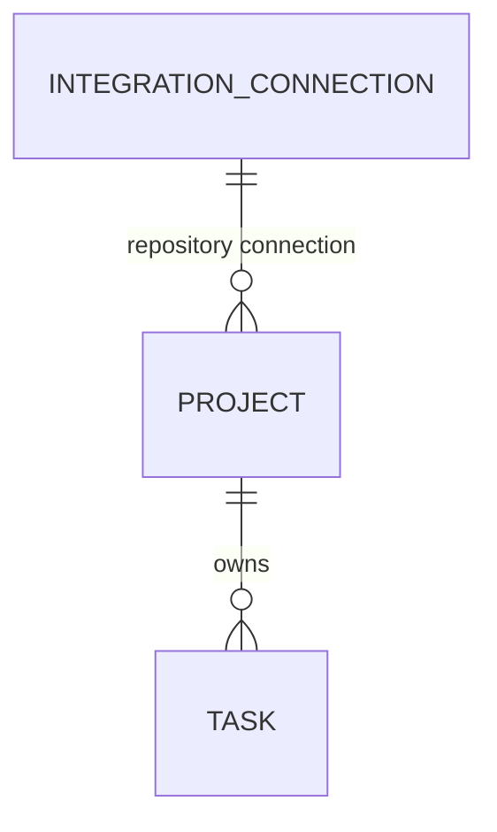

# 功能规格：Prisma 多数据库 RDB

**Feature Branch**: `040-prisma-rdb`
**Created**: 2026-08-05
**Revised**: 2026-08-06
**Status**: Approved for implementation
**Input**: 由 Prisma 接管 RDB，并实现 SQLite、PostgreSQL 与 Supabase-backed PostgreSQL；提供启动时 provider 切换配置、独立迁移配置及 `INSTALLATION.md` 安装说明。Owner 反馈要求 capability 以内嵌 JSON 保存，不提前建立联动表；第一期同时移除待重做的 Project execution defaults、ContextBundle、Runner 与 Session persistence。Project 只保存 stable Repository identity；Task 只保留 identity、Project relation、Issue dispatch 幂等键和通用元数据，Issue/Repository snapshot 与 cache 设计留给后续 Integration 规格。

## User Scenarios & Testing

本功能属于持久化所有权与部署能力迁移。以下场景以平台维护者、自托管操作员、SaaS
操作员和未来 provider 实现者为 actor，避免把数据库生命周期伪装成消费型 UI 故事。

### 场景 1：Prisma 接管全部关系型持久化 (Priority: P1)

作为平台维护者，我希望 SQLite 与 PostgreSQL 的关系模型、迁移历史、生成类型和数据访问
均由 Prisma 管理，以便删除手写 schema/CRUD 的双重事实来源，并让两种数据库实现遵守同一
领域合同。

**Why this priority**: 若 Prisma 只覆盖部分操作，Mystra 将同时维护 Prisma、手写 SQL 和
多套迁移语义。那不是接管，只是增加了更多可以互相否认的事实来源。

**Independent Test**: 对 SQLite 和 PostgreSQL 分别从空库运行迁移，再执行同一套
`RdbProvider` contract tests；静态审计证明业务 CRUD 只通过 Prisma-backed provider 完成。

**Acceptance Scenarios**:

1. **Given** 一个空 SQLite 文件或空 PostgreSQL schema，**When** 操作员部署迁移并启动 control plane，**Then** 完整关系模型可用且无需手工 SQL。
2. **Given** 任一 `RdbProvider` 操作，**When** control plane 访问数据库，**Then** 数据访问通过对应 Prisma Client 与官方 driver adapter 完成。
3. **Given** 同一业务 fixture，**When** 分别在 SQLite 和 PostgreSQL 上执行，**Then** 返回的 Mystra domain objects、排序、冲突和生命周期语义一致。

---

### 场景 2：既有 SQLite 数据可安全接管 (Priority: P1)

作为自托管操作员，我希望受支持的现有 Mystra SQLite 数据库升级到 Prisma 管理后保留
三张获批候选实体的业务记录、关系和约束，以便升级保留 IntegrationConnection、Project 与 Task
数据；已明确移出第一期的 Session、ContextBundle、Runner、SessionEvent 与 Artifact rows 不迁移。

**Why this priority**: 把“迁移”实现为删除数据当然很稳定。数据库再也不会报告一致性错误，
因为它已经没有内容。该方案不予采用。

**Independent Test**: 使用迁移前完整 fixture 执行接管，逐实体、逐关系核对迁移前后记录
与可观察 API 结果，并验证重复部署迁移不产生二次变更。

**Acceptance Scenarios**:

1. **Given** 当前受支持 schema 的非空 SQLite 数据库，**When** 首次纳入 Prisma migration history，**Then** 三张获批候选表的保留字段、标识符、关系、唯一性和归档状态保持不变，GitHub connection 的 repository 字段被无损合并到 `capabilities.repositories`，Project 的 `repository_snapshot.externalId` 被提升为 `repository_external_id`，`tasks.dispatch_key` 被迁移为 `issue_dispatch_key`，Session 等明确删除的表和字段被记录并移除。
2. **Given** 已完成接管的数据库，**When** 再次执行部署迁移，**Then** 不重复导入、不重复创建记录，也不改变业务数据。
3. **Given** 未知、混合、损坏或 migration metadata 不一致的 SQLite schema，**When** 系统尝试接管，**Then** 在写入业务数据前 fail closed，并保留原数据库。
4. **Given** 任一迁移步骤失败，**When** 操作员检查结果，**Then** 可以定位失败 migration 和恢复入口，不会得到被声称成功的部分终态。

---

### 场景 3：通过配置选择 SQLite、PostgreSQL 或 Supabase (Priority: P1)

作为部署操作员，我希望通过一个受校验的启动配置选择 RDB，并为 hosted PostgreSQL 提供
运行时与迁移连接配置，以便相同应用制品可以用于本地开源安装和 SaaS 部署。

**Why this priority**: 若 provider 选择散落在路由或服务代码中，所谓“可切换”只是每位
维护者都能发明自己的环境变量。

**Independent Test**: 对三个 provider 值运行配置矩阵，验证正确实现被实例化、缺失或冲突
配置在连接前失败、日志不包含凭据，并证明修改配置只在重启后生效。

**Acceptance Scenarios**:

1. **Given** `MYSTRA_RDB_PROVIDER=sqlite`，**When** control plane 启动，**Then** 使用 `MYSTRA_DB_PATH` 或默认路径实例化 SQLite provider。
2. **Given** `MYSTRA_RDB_PROVIDER=postgresql`，**When** 配置合法的 `MYSTRA_DATABASE_URL`，**Then** 使用 PostgreSQL Prisma client 和 `@prisma/adapter-pg`。
3. **Given** `MYSTRA_RDB_PROVIDER=supabase`，**When** 配置 pooled runtime URL 与 direct migration URL，**Then** runtime 使用 PostgreSQL provider，迁移命令只使用 direct URL。
4. **Given** provider 值未知、URL scheme 错误或必需配置缺失，**When** 进程初始化数据库，**Then** 在发起连接前返回可操作但不泄密的配置错误。
5. **Given** 进程已经初始化 provider，**When** 环境变量在进程外变化，**Then** 当前进程不热切换数据库；操作员必须重启。

---

### 场景 4：领域合同不暴露 Prisma 或数据库方言 (Priority: P1)

作为 API、MCP、CLI 或 Web 的内部调用者，我希望 `RdbProvider` 的领域输入、输出、
错误和事务语义保持稳定，以便持久化迁移不会成为外部产品合同迁移。

**Why this priority**: Prisma 是持久化实现，不是 Mystra 业务模型。生成 model、连接池和
数据库错误若穿透边界，replaceable provider 会迅速退化为装饰性接口。

**Independent Test**: 使用同一套 provider contract tests 覆盖 SQLite 与 PostgreSQL；
静态检查 shared contracts、route response 和 MCP schema 不存在 Prisma、
SQLite 或 `pg` 类型泄漏。

**Acceptance Scenarios**:

1. **Given** 未列入删除面的 canonical API、MCP、CLI 和 Web 调用，**When** 底层 provider 改变，**Then** 请求和响应 payload、排序、幂等、not-found、冲突与状态转换语义不变。
2. **Given** Prisma Client 是异步 API，**When** `RdbProvider` 与内部调用者迁移为 `Promise`，**Then** 仅内部 TypeScript 调用签名改变，网络合同和业务语义保持不变。
3. **Given** Issue dispatch 的 Task 写入失败，**When** 事务回滚，**Then** 不产生部分 Task 记录；Session lifecycle 不属于本期合同。
4. **Given** 任一 service boundary，**When** 维护者检查依赖，**Then** 只发现 Mystra-owned TypeScript/Zod contract。

---

### 场景 5：安装文档支持三种部署形态 (Priority: P2)

作为首次安装或升级的操作员，我希望一份根目录 `INSTALLATION.md` 说明依赖、配置、迁移、
启动、验证和故障恢复，以便不需要从源码和聊天历史推断安装步骤。

**Why this priority**: 能运行但无法被正确安装的软件仍然是一种精致的本地现象。

**Independent Test**: 在干净环境分别按 SQLite、local PostgreSQL 和 Supabase 章节执行文档；
命令可复制、配置项完整、迁移与 runtime URL 用途清晰，且 README 可发现该文档。

**Acceptance Scenarios**:

1. **Given** 新操作员打开仓库 README，**When** 查找安装入口，**Then** 可直接导航到 `INSTALLATION.md`。
2. **Given** 任一受支持 provider，**When** 操作员按文档安装，**Then** 可以安装依赖、配置环境、部署 migration、启动并完成健康验证。
3. **Given** Supabase 部署，**When** 操作员阅读配置表，**Then** pooled runtime URL 与 direct migration URL 的用途、网络限制和秘密处理明确区分。
4. **Given** 升级失败或 schema drift，**When** 操作员查阅文档，**Then** 能找到非破坏性诊断和恢复步骤；文档不建议自动 reset 生产数据库。

### Edge Cases

- SQLite 路径不存在、父目录不可写、文件只读或被其他进程锁定。
- PostgreSQL/Supabase DNS、TLS、IPv4/IPv6、凭据、schema 权限或连接数配置错误。
- Supabase pooled URL 被错误用于 migration，或 direct URL 在部署网络不可达。
- Prisma Client 未生成、生成资产与 schema/provider 不一致，或迁移历史发生 drift。
- SQLite 与 PostgreSQL 对 enum、boolean、时间、JSON、部分索引和 foreign key 的表达不同。
- JSON 字段包含历史允许但当前 Zod schema 不接受的值。
- capabilities 整体更新或重复 Task dispatch key 发生竞争。
- migration 中途终止后重试；PostgreSQL migration lock 未释放；SQLite 文件处于部分复制状态。
- provider 配置在测试间污染 singleton，或热重载创建过多 PostgreSQL pool。
- Repository 在 Provider 侧 rename、delete、archive，或 Connection 权限被撤销；040 只保证 Project
  stable identity 不需要随名称变化改写，Repo Info 查询、展示、缓存与失效行为留给后续规格。
- 既有 Project snapshot 缺失 `externalId`，或同一 snapshot 的 external identity 与绑定 Connection 无法解析；
  adoption 必须 fail closed，不得回退到可变 `fullName` 作为永久 identity。
- 040 feature branch 尚未同步 `main@10750ca`；该 baseline 已包含 039 与 041 的最终
  IntegrationConnection、Project 与 SecretProvider contracts。

## Requirements

### Functional Requirements

- **FR-001**: Prisma MUST 成为 SQLite 与 PostgreSQL 关系模型、migration history、生成 client 和运行时 CRUD 的所有者。
- **FR-002**: SQLite 与 PostgreSQL MUST 使用各自的 Prisma datasource、生成 client 和 migration history；不得声称一套 migration SQL 可跨方言复用。
- **FR-003**: 两套 Prisma schema MUST 表达同一 Mystra 逻辑数据模型，并通过自动 parity 检查防止无意漂移；经记录的方言差异除外。
- **FR-004**: SQLite runtime MUST 使用 Prisma Client 与 `@prisma/adapter-better-sqlite3`；PostgreSQL 和 Supabase runtime MUST 使用 Prisma Client 与 `@prisma/adapter-pg`。
- **FR-005**: Supabase MUST 复用 PostgreSQL provider 实现、Prisma client 与 migration history；不得引入 `supabase-js` 作为 RDB CRUD 的第二路径。
- **FR-006**: 现有手写 SQLite CRUD 与独立 schema version 系统 MUST 被替换；所有运行时业务
  CRUD 与 lifecycle transition MUST 只通过 Prisma Client API 实现，不得使用
  `$queryRaw`、`$executeRaw`、`pg.query` 或 `better-sqlite3` 业务查询。Prisma Migrate 生成或审查的
  migration SQL 与旧 SQLite 接管前只读 fingerprint 不属于运行时业务 CRUD。
- **FR-007**: Mystra MUST 保留 `RdbProvider` 作为 API、MCP、CLI、Web 与持久化实现之间的领域合同。
- **FR-008**: `RdbProvider` MUST 迁移为异步方法以匹配 Prisma；所有保留的内部调用者 MUST 显式 `await`。
  除 FR-029 至 FR-040 的明确删除、重命名、Repository identity 和 Integration capability 合同修订外，未删除的外部
  HTTP/MCP/CLI/Web payload 不得改变。
- **FR-009**: Prisma model、input、transaction client、错误类、adapter、connection URL 和 pool 类型 MUST NOT 出现在 shared contracts 或 service boundaries。
- **FR-010**: provider implementations MUST 返回现有 Mystra-owned domain/Zod types，并保持字段、排序、幂等、not-found、冲突与生命周期语义。
- **FR-011**: Issue dispatch MUST 通过 nullable unique `tasks.issue_dispatch_key` 在 Task 持久化范围内保持
  幂等与并发不变量。Session create、
  lifecycle、cancellation、completion、result 与 assignment persistence 整体不进入第一期 Prisma 合同；
  不得保留 `session_events` append 路径。现有 Runner enrollment、heartbeat 与 claim persistence 同样不进入。
- **FR-012**: provider selection MUST 由 `MYSTRA_RDB_PROVIDER=sqlite|postgresql|supabase` 在进程启动时完成；默认值 MUST 为 `sqlite` 以保持开源本地安装兼容。
- **FR-013**: SQLite MUST 支持 `MYSTRA_DB_PATH`；PostgreSQL/Supabase runtime MUST 使用 `MYSTRA_DATABASE_URL`；migration CLI MUST 使用 `MYSTRA_DIRECT_DATABASE_URL`，若普通 PostgreSQL 部署未提供 direct URL，可显式回退到 runtime URL。
- **FR-014**: Supabase profile MUST 要求显式 `MYSTRA_DIRECT_DATABASE_URL`，不得把 transaction-mode pooler URL 用于 Prisma migration。
- **FR-015**: 配置 MUST 在连接前通过 Zod boundary validation；错误不得回显用户名、密码、query token 或完整 URL。
- **FR-016**: provider singleton MUST 能在测试中可靠关闭和重置；开发热重载不得无界创建 PostgreSQL pools。
- **FR-017**: 新安装 MUST 通过已提交 migration 从空 SQLite 或空 PostgreSQL schema 初始化；生产启动不得隐式运行 destructive reset 或 `migrate dev`。
- **FR-018**: 当前受支持 SQLite schema MUST 被 baseline 到 Prisma history，完整保留
  `integration_connections`、`projects`、`tasks` 的获批字段、标识符、时间戳、JSON、关系、
  唯一性和归档状态；现有 GitHub connection 的 `repository_selection`、`permissions`、
  `access_summary` MUST 无损合并到 `capabilities.repositories`。Session、ContextBundle、Runner、
  SessionEvent、Artifact rows 与明确删除的 Project/Task 字段属于批准的破坏性删除面。
- **FR-019**: SQLite 接管 MUST 幂等；未知、混合、损坏或不匹配 schema MUST fail closed，不得猜测、删除或重建业务数据。
- **FR-020**: 开发环境 MUST 提供 generate、migration creation、migration deploy、drift check、test reset 与 provider-specific schema selection 命令。
- **FR-021**: PostgreSQL/Supabase production migration MUST 使用非交互 `prisma migrate deploy` 和 direct connection；runtime connection pool 参数 MUST 由 `pg` adapter 配置而不是无效的 Prisma 6 URL 参数。
- **FR-022**: 最终 baseline MUST 包含 `main@10750ca` 中 039 与 041 的 IntegrationConnection、
  Project、SecretProvider contracts；ER 获批后、040 实现前 MUST merge/rebase/reconcile 该 baseline。
- **FR-023**: `INSTALLATION.md` MUST 覆盖系统前置条件、依赖安装、三种 provider 配置、migration、启动、健康检查、升级、备份/恢复入口和常见故障。
- **FR-024**: README MUST 链接 `INSTALLATION.md`；module README MUST 记录 provider factory、配置 owner、migration owner 与 secrets invariants。
- **FR-025**: SQLite 与 PostgreSQL MUST 运行同一套 provider contract tests；PostgreSQL tests MUST 使用真实 PostgreSQL 实例而不是 mock driver。
- **FR-026**: Supabase MUST 至少通过配置/URL 路由测试和 PostgreSQL protocol contract suite；若未提供外部 Supabase project，验收证据 MUST 明确区分本地 PostgreSQL evidence 与未执行的云端 connectivity check。
- **FR-027**: 连接字符串、数据库密码和 Supabase credentials MUST 只通过运行时环境注入，不得提交、写入数据库或出现在测试快照和日志中。
- **FR-028**: 本功能 MUST NOT 引入 public hosted multi-tenancy、Team 管理、RLS 产品合同、数据库管理 UI 或自动创建外部 Supabase project。
- **FR-029**: Prisma 第一期业务模型 MUST 只包含 `integration_connections`、`projects`、`tasks`；
  MUST 删除 `sessions`、`context_bundles`、`runners`、`session_events`、`artifacts` 与旧
  `mystra_schema`，不得继续用旧 SQL 维护这些表。
- **FR-030**: event-derived `CoordinationSessionSummary`、`GET /api/sessions/:id/summary`、
  `mystra_get_session_summary` 与对应 provider/shared contracts MUST 删除，不得改存为 Session phase
  或 summary 字段。所有 Task child-Session relation projections 也随 Session persistence 延后。
- **FR-031**: `ExecutionContractReference.artifactId` MUST 与 Artifact entity 一并删除，不得改名或
  新增替代 identity。`ExecutionSpecArtifact` MUST 改为 `ExecutionSpecSnapshot`，URI MUST 离开
  `/artifacts/` namespace；execution contract 继续作为 Session-owned frozen inline snapshot。
- **FR-032**: `IntegrationConnection` MUST 只表达 provider connection identity、auth method、
  non-secret connection config、credential reference 与 lifecycle；MUST NOT 要求 repository-specific
  顶层字段。Connection-specific 可用模块 MUST 保存于同一 `capabilities` serialized JSON 字段，不得
  建立第一期 capability 子表，也不得为每项 capability 增加物理列。Connection identity MUST 以
  `(integration, provider, provider_external_id)` 唯一，避免不同 provider namespace 互相冲突。
- **FR-033**: Capability key MUST 为 plugin-declared 可扩展 string，而不是数据库 enum。
  每项 value MUST 使用统一的 `state/config/permissions/accessSummary/verifiedAt` envelope，并由 Zod
  原子校验。`repositories`、`issues` 是当前实现方向；`change-requests`、`code-reviews`、`ci`、
  `deployments` 可在未来扩展而不修改表结构。
- **FR-034**: Project 创建/仓库重新解析 MUST 验证 `repository_connection_id` 指向 active connection，
  且该 connection 的 `capabilities.repositories.state=enabled`。Linear/Jenkins 等无 repository
  capability 的 connection MUST 能正常存在，但不得绑定为 Project repository source。
- **FR-035**: `projects.base_branch` MUST 改名为 `repository_base_branch`。`projects.default_agent`、
  `projects.runtime`/候选 `runtime_config` 与 `projects.prewarm_config` MUST 从第一期 schema 和写入合同删除，
  且不得转存到 `metadata`。
- **FR-036**: 现有 ContextBundle catalog/CRUD、Runner persistence/management/assignment CRUD 与
  Session persistence/CRUD MUST 从第一期活动 RDB 合同移除。未来设计分别由新的 Context delivery、
  Runtime capacity 与 Session persistence 规格承担。
- **FR-037**: `projects.repository_snapshot` MUST 删除并替换为非空
  `projects.repository_external_id`。`repository_connection_id + repository_external_id` MUST 构成不可变
  Project Repository binding；Repository rename 不得触发 Project 持久化更新。
- **FR-038**: Repository 的 `fullName`、URL/clone URL、Provider default branch、visibility、archive/delete
  状态和 `fetchedAt` MUST NOT 进入第一期 Prisma model。040 MUST NOT 新增 Repository cache、TTL、
  refresh、invalidation、Repo Info query service 或对应测试；这些能力必须由后续规格设计。
- **FR-039**: `tasks.source`、`tasks.objective`、`tasks.issue_snapshot` 与 `tasks.repository_snapshot` MUST
  从第一期 schema 和写入合同删除，且不得转存到 `metadata`。`tasks.dispatch_key` MUST 改名为
  `tasks.issue_dispatch_key`。Issue/Repository 当前信息未来通过 Integration-owned cache 设计提供；040
  MUST NOT 定义或实现 cache key、payload、TTL、refresh 或 invalidation。
- **FR-040**: 040 MUST 完成三表 Prisma schema、migration、保留 CRUD 与数据库配置；由批准删除字段/表
  引发的既有 UI、API、MCP、Runner 或其他功能报错不属于本期修复范围，不得为消除这些报错恢复旧字段、
  旧表或旁路 SQL。受影响功能必须记录为后续适配清单。

### Key Entities

Prisma 第一期 ER（逐字段定义与命名审计见 [data-model.md](./data-model.md)）：

- **RdbConfiguration**: 启动时解析的 provider discriminated union；分别约束 SQLite path、PostgreSQL runtime/direct URL 和 Supabase pooled/direct URL。
- **Prisma Schema Bundle**: provider-specific datasource、逻辑模型、生成策略和 parity rule 的版本化集合。
- **SQLite Migration History**: SQLite 新建与既有数据库接管所使用的独立 Prisma migration history。
- **PostgreSQL Migration History**: PostgreSQL 与 Supabase 共同使用的 Prisma migration history。
- **Prisma RDB Provider**: `RdbProvider` 的 Prisma-backed 实现，负责 domain/model 映射、事务、错误归一化和连接生命周期。
- **Supabase Deployment Profile**: PostgreSQL provider 的配置变体，区分 runtime pooler 与 direct migration connection，不产生新的 domain provider contract。
- **Supported Existing Database**: 与接管前受支持 fingerprint 匹配、可无损 baseline 的 SQLite 数据库。
- **Unknown Database**: fingerprint、migration metadata 或结构与受支持输入不一致的数据库，必须 fail closed。

## Assumptions

- 用户的 2026-08-06 指令是对 hosted RDB 排除项的显式 product-boundary amendment。
- “切换配置”指进程启动时选择 provider，不包含运行中热切库或跨数据库在线数据复制。
- Supabase 被视为 PostgreSQL 托管部署形态；本功能不使用 Supabase Data API 或 `supabase-js` 承担 RDB CRUD。
- SQLite 仍为默认 provider，以保持本地开发和开源单机安装的最低门槛。
- `main@10750ca` 是 implementation dependency；040 必须吸收其中 039 与 041 的最终 schema 和
  contracts 后才能生成 Prisma baseline。
- Prisma 具体版本在 plan 阶段按 Node 24.14.0 与 pnpm 10.25.0 兼容性锁定。
- 官方设计依据包括 [Prisma PostgreSQL connector](https://docs.prisma.io/docs/orm/v6/overview/databases/postgresql)、[Prisma database connections](https://www.prisma.io/docs/orm/prisma-client/setup-and-configuration/databases-connections)、[Prisma data sources](https://docs.prisma.io/docs/orm/v6/prisma-schema/overview/data-sources)、[migration histories](https://www.prisma.io/docs/orm/prisma-migrate/understanding-prisma-migrate/migration-histories) 与 [Supabase connection modes](https://supabase.com/docs/guides/database/connecting-to-postgres)。

## Explicitly Out of Scope

- 删除 `RdbProvider` 或让调用者直接依赖 Prisma Client。
- 运行时热切换数据库、跨 provider 在线数据复制或 SQLite-to-PostgreSQL 自动数据搬迁。
- public hosted multi-tenancy、Team/RLS 管理、region routing 或 per-tenant database provisioning。
- Supabase Auth、Storage、Realtime、Data API 或自动创建/管理 Supabase project。
- 数据库管理控制台或 Prisma Studio 的产品化 UI。
- Repo Info 查询、Provider re-resolution、缓存、TTL、refresh、invalidation 及 rename/delete 后的上层展示或执行适配。
- Issue Info/Repository Info cache 的 key、payload、TTL、refresh、invalidation 与消费合同。
- Session persistence、字段、关系、状态机、CRUD、迁移与上层适配；040 只删除旧 Session 表及其 RDB surface，
  后续必须通过新规格重新设计。
- 除明确删除 event-derived Session coordination summary/`artifactId`、Project execution defaults、Project
  Repository snapshot persistence、Session/ContextBundle/Runner persistence，以及把 IntegrationConnection
  修订为 provider-neutral connection + capabilities JSON 外，改变 Task、Project、Integration、Issue 或
  Repository 的其他合同。
- 重新设计 Session、Runner、Runtime、Sandbox、Context delivery、Agent profile 或 Prewarm；040 只移除旧持久化面。

## Success Criteria

### Measurable Outcomes

- **SC-001**: SQLite 与真实 PostgreSQL 上 100% 的三表 provider contract tests 通过；批准删除面引发的上层功能报错不计入本期通过条件，但不得存在旧 SQL/旧表兼容回退。
- **SC-002**: 对受支持非空 SQLite upgrade fixture，三张候选表 30 个获批字段迁移前后 100% 记录、标识符、关系、唯一性、时间戳、JSON 与归档状态一致；每条现有 GitHub connection 生成等价 `capabilities.repositories`，每个 Project 从 snapshot 提升 stable `repository_external_id`，每个旧 `dispatch_key` 无损迁移为 `issue_dispatch_key`，并验证包括 Session 与 Task snapshots 在内的全部批准删除面不存在。
- **SC-003**: 三种 provider 配置均能实例化预期实现；无效配置矩阵 100% 在连接前失败且输出中不包含凭据。
- **SC-004**: 空 SQLite、空 PostgreSQL 和 Supabase-compatible PostgreSQL schema 均可仅用已提交 migration 初始化；连续执行两次 deploy，第二次产生 0 个 schema 和业务数据变更。
- **SC-005**: 静态边界检查在持久化模块之外发现 0 个 Prisma/driver import，shared/API/MCP contracts 发现 0 个数据库实现类型。
- **SC-006**: 未知、混合和损坏 SQLite schema 的失败 fixture 均在业务写入前停止并保留原文件校验值或验证过的事务回滚结果。
- **SC-007**: `INSTALLATION.md` 的 SQLite 与 local PostgreSQL 路径在干净环境可完整执行；Supabase 章节通过配置校验，并在有外部 project credentials 时完成 connectivity smoke test。
- **SC-008**: focused persistence、provider contract、migration 与 configuration tests 全部通过；全仓 lint/typecheck/test/build 的既有失败和新增失败均形成按删除面归因的后续适配清单，不作为 040 数据层交付的阻断条件。
- **SC-009**: 文档与代码审查能定位 provider-specific Prisma schema/migration histories、一个 domain-neutral `RdbProvider`、一个受校验 provider factory，以及一份根目录安装说明；不存在并行手写 CRUD/schema owner。
