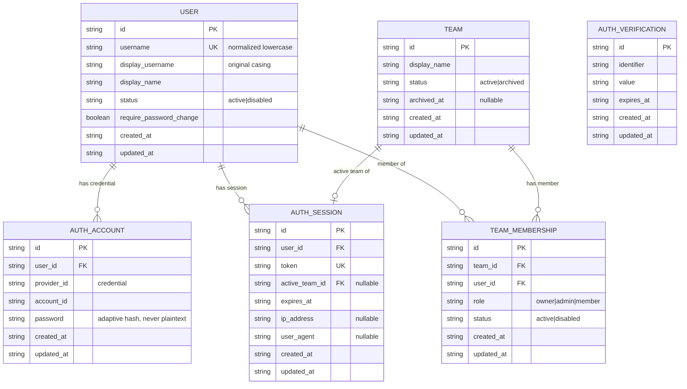

# 数据模型：本地用户、Team 与 RBAC

**Status**: Phase 1 draft — 常规 spec/plan Owner 评审
**Baseline**: 040 Prisma 第一期（`integration_connections`、`projects`、`tasks`、`secret_envelopes`）
**Owner 决策依据**: research.md R1–R9

> 本文件定义 043 需要向 Prisma schema 新增的 Auth 与 RBAC 模型。043 是 self-host 身份/授权关系数据，Prisma 是其唯一 schema/migration/runtime access owner（FR-044）。所有物理表在 SQLite 与 PostgreSQL/Supabase-backed PostgreSQL 上 model 段 byte-identical（FR-045），沿用 040 的命名与序列化约定。

## 命名与序列化约定（继承 040）

- Prisma model 单数 PascalCase；物理表复数 `snake_case`（`@@map`）。
- Prisma field `camelCase`；物理列 `snake_case`（`@map`）。
- ID 为领域层生成的 UUID string；两库均不改自增。
- 时间存 ISO-8601 string；结构化对象存经 Zod 校验的 serialized JSON string，保持 provider parity。
- 领域前缀规则：跨领域字段带来源前缀。
- **命名冲突规避**：Better Auth session 物理表命名为 `auth_sessions`，与 040 已删除、后续重新设计的 Mystra 执行 “Session” 概念显式区分（research R2）。

## 新增表清单（6 张）

Auth 引擎（Better Auth，经 Prisma adapter 定义与迁移）：
1. `users`
2. `auth_accounts`（本地 username/password 凭据 = spec 的 LocalCredentialAccount）
3. `auth_sessions`（= spec 的 AuthSession，含 active Team 引用）
4. `auth_verifications`（Better Auth 结构性要求，首期无 email 流程使用它，保留为空表）

Mystra-owned RBAC 领域：
5. `teams`
6. `team_memberships`（含反规范化 `role` 列 = spec 的 RoleBinding）

**不建表**（research R3）：`roles`、`permissions`、`role_bindings`。Role（`owner|admin|member`）与 Permission catalog 为代码级稳定目录；RoleBinding 反规范化到 `team_memberships.role`。

## ER 图

---

## 逐表定义

### 1. `users`（Better Auth user + Mystra 附加字段）

Prisma model `User`。self-host **无 email 列**（research R1；FR-008/SC-009）。

| 物理列 | Nullable | 类型/枚举 | 作用 |
|---|---:|---|---|
| `id` | 否 | UUID string | 稳定内部 User ID；所有关系与未来扩展的身份锚点（FR-005）。|
| `username` | 否 | string（规范化小写） | 平台范围大小写不敏感唯一的登录标识；应用层规范化后存入（FR-006/FR-014，research R5）。|
| `display_username` | 是 | string | username 的原始大小写展示形式；不参与登录与唯一性。|
| `display_name` | 否 | string | 可修改、可重复的展示名；不得用于认证/唯一性/授权（FR-007）。|
| `status` | 否 | `active \| disabled` | 账户状态；`disabled` 时 fail closed 拒绝受保护资源（FR-010）。|
| `require_password_change` | 否 | boolean，默认 `false` | 标记强制改密；`true` 时改密前只放行最小账户安全流程（FR-003）。默认 admin 由 bootstrap 置 `true`。|
| `created_at` | 否 | ISO-8601 string | 创建时间。|
| `updated_at` | 否 | ISO-8601 string | 最后更新时间。|

约束：
- PK：`id`。
- Unique：`username`（普通唯一，比较对象是应用层已规范化的小写值）。
- Index：`(created_at, id)`。
- 不含 `email` / `email_verified`：注册、登录、成员管理、恢复表面均不收集/保存/推导/查询 email。

### 2. `auth_accounts`（LocalCredentialAccount）

Prisma model `AuthAccount`。保存 username/password 的凭据绑定与安全元数据；只存 hash（FR-013）。

| 物理列 | Nullable | 类型/枚举 | 作用 |
|---|---:|---|---|
| `id` | 否 | UUID string | 凭据记录 ID。|
| `user_id` | 否 | UUID FK → `users.id` | 归属 User。|
| `provider_id` | 否 | string | Better Auth 凭据 provider；本地固定 `credential`。|
| `account_id` | 否 | string | Better Auth 账户标识（本地等于 user 引用）。|
| `password` | 是 | string | 自适应 password hash；永不存明文（FR-013）。仅 credential 账户有值。|
| `created_at` | 否 | ISO-8601 string | 创建时间。|
| `updated_at` | 否 | ISO-8601 string | 最后更新时间（改密时刷新）。|

约束：
- PK：`id`；`user_id` FK → `users.id`，`ON DELETE CASCADE`（账户删除随 User 生命周期）。
- Unique：`(provider_id, account_id)`。
- Index：`user_id`。

### 3. `auth_sessions`（AuthSession，承载 active Team context）

Prisma model `AuthSession`。可撤销、有过期时间的认证会话（FR-010/FR-012）。承载 active Team 引用（research R6）。

| 物理列 | Nullable | 类型/枚举 | 作用 |
|---|---:|---|---|
| `id` | 否 | UUID string | Session ID。|
| `user_id` | 否 | UUID FK → `users.id` | 归属 User。|
| `token` | 否 | string | Session token 标识（服务端持有；不进 URL/日志/证据）。|
| `active_team_id` | 是 | UUID FK → `teams.id` | 当前 active Team context；每请求服务端校验，失效则 fail-closed 回退（FR-021）。|
| `expires_at` | 否 | ISO-8601 string | 过期时间。|
| `ip_address` | 是 | string | 会话来源 IP（安全审计，可空）。|
| `user_agent` | 是 | string | 会话 UA（可空）。|
| `created_at` | 否 | ISO-8601 string | 创建时间。|
| `updated_at` | 否 | ISO-8601 string | 最后活动/更新时间。|

约束：
- PK：`id`；Unique：`token`。
- `user_id` FK → `users.id`，`ON DELETE CASCADE`。
- `active_team_id` FK → `teams.id`，`ON DELETE SET NULL`（Team 归档不硬删，此为兜底；正常失效走应用层 fail-closed 回退）。
- Index：`user_id`、`(expires_at, id)`。

### 4. `auth_verifications`

Prisma model `AuthVerification`。Better Auth 结构性表；首期不启用任何 email/OTP/reset 流程，保持为空。保留以满足引擎 schema，并为未来强认证因子扩展预留（FR-047，仅结构不启用）。

| 物理列 | Nullable | 类型/枚举 | 作用 |
|---|---:|---|---|
| `id` | 否 | UUID string | 记录 ID。|
| `identifier` | 否 | string | 校验标识（首期不产生记录）。|
| `value` | 否 | string | 校验值。|
| `expires_at` | 否 | ISO-8601 string | 过期时间。|
| `created_at` | 否 | ISO-8601 string | 创建时间。|
| `updated_at` | 否 | ISO-8601 string | 更新时间。|

约束：PK `id`；Index `identifier`。首期无写入路径（无 email/OTP/reset），仅存在以满足引擎结构。

### 5. `teams`（Team）

Prisma model `Team`。Mystra 顶层租户（FR-019）。

| 物理列 | Nullable | 类型/枚举 | 作用 |
|---|---:|---|---|
| `id` | 否 | UUID string | 稳定 Team ID；租户边界，授权解析只用 ID，不用名称（边界）。|
| `display_name` | 否 | string | 可修改、可重复的展示名（FR-023）。初始 Team 的默认名由 bootstrap/注册指定（例如 `Default`）。|
| `status` | 否 | `active \| archived` | 生命周期；删除 Team = 置 `archived`（FR-024，research R7）。|
| `archived_at` | 是 | ISO-8601 string | 非空表示已归档；从 active switcher 移除。|
| `created_at` | 否 | ISO-8601 string | 创建时间。|
| `updated_at` | 否 | ISO-8601 string | 最后更新时间。|

约束：
- PK：`id`。
- Index：`status`、`(created_at, id)`。
- `display_name` 无唯一约束（Team 名称可重复；边界）。

### 6. `team_memberships`（TeamMembership + 反规范化 RoleBinding）

Prisma model `TeamMembership`。将一个 User 关联到 Team，保存状态与 active Team Role（FR-028/FR-034）。首期 Principal 仅 User。

| 物理列 | Nullable | 类型/枚举 | 作用 |
|---|---:|---|---|
| `id` | 否 | UUID string | Membership ID。|
| `team_id` | 否 | UUID FK → `teams.id` | 所属 Team。|
| `user_id` | 否 | UUID FK → `users.id` | 成员 User。|
| `role` | 否 | `owner \| admin \| member` | active Team Role（反规范化的 RoleBinding，research R3）；变更对新请求立即生效（FR-035）。|
| `status` | 否 | `active \| disabled` | 成员生命周期；`disabled`/移除后下一请求 fail closed（FR-028/FR-027）。|
| `created_at` | 否 | ISO-8601 string | 创建时间。|
| `updated_at` | 否 | ISO-8601 string | 最后更新时间。|

约束：
- PK：`id`。
- **Unique：`(team_id, user_id)`**（一个 User 在一个 Team 至多一条 membership，避免重复添加，FR-030 场景 3）。
- `team_id` FK → `teams.id`，`ON DELETE RESTRICT`（归档而非级联删）。
- `user_id` FK → `users.id`，`ON DELETE RESTRICT`。
- Index：`user_id`、`(team_id, status)`、`(team_id, role)`。

## 服务层强制的业务不变量（非 DB 约束）

以下不变量无法用单列 SQL 约束表达，由 `src/lib/teams` 与 `src/lib/rbac` 在事务内强制，并有 contract 测试覆盖：

1. **原子注册/bootstrap**（FR-009/FR-018）：User + AuthAccount + Team + TeamMembership(owner/active) + AuthSession 在单事务成败一致；注册即产生一个由该 User 拥有的初始 Team。
2. **每 Team 至少一名有效 Owner**（FR-036）：移除/停用/降级/退出最后一名 `role=owner,status=active` 成员前必须已存在另一名有效 Owner，否则拒绝。
3. **每 User 至少一个 active Team**（FR-017/FR-037）：任何删除、退出或移除动作若会使某 User 失去其全部 active Team，必须拒绝。
4. **唯一 active Team 不可删/不可退出**（FR-025）：某 User 当前唯一 active Team 的删除与退出动作对该 User 不可用。
5. **active Team 有效性**（FR-021/FR-027）：每请求校验 `active_team_id` 对应 Team `active` 且 User membership `active`，否则回退到另一个有效 Team 或要求显式选择。
6. **username 规范化唯一**（FR-014）：写入前经共享合同规范化；DB 唯一约束是最终屏障。

## Provider parity（延续 040）

SQLite 与 PostgreSQL 使用独立 datasource/client/migration history，但 6 张新表的 field、`@map`/`@@map`、nullability、relation、referential action、unique/index 必须字节一致；`prisma-schema-parity.test.ts` 的模型集合断言更新为：
`IntegrationConnection, Project, Task, SecretEnvelope, User, AuthAccount, AuthSession, AuthVerification, Team, TeamMembership`。Supabase 复用 PostgreSQL schema/client/provider，仅改连接 profile（FR-043）。

## 与 040 的关系

040 的“实现任务和代码不得自行扩表，须重新提交 Owner 审批”约束的是 040 自身实现，不封锁后续新功能。043 作为新功能，通过本 data-model 引入上述 6 张 Auth/RBAC 表，不改动 040 既有 4 张表的字段/关系，走常规 spec/plan Owner 评审。实现时更新 `prisma-schema-parity.test.ts` 的模型集合断言为 10 个 model。
