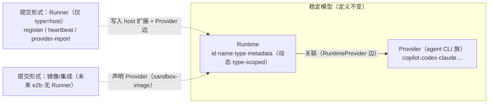

# Data Model：Runtime ↔ Provider（Runner 为 host 提交形式）

**Feature**: `044-host-runtime-daemon` | **Phase**: 1（设计）
**范围**: 稳定抽象 **Runtime ↔ Provider**；以及当前唯一落地的提交形式 **Runner**（仅 `type=host`）。Agent 配置、Context、执行/Session、Sandbox 规格/实例不在本 feature（由 042 及后续拥有）。

## 核心抽象（定义不变）

**Runtime ↔ Provider 关联**是稳定业务模型：一个 Runtime 拥有一组它能提供的 Provider（agent CLI）能力。Runtime 与 Provider 的定义与此关联**不随提交方式改变**。

**如何把 Runtime+Provider 提交进平台**是可替换的、来源无关的"提交形式（submission form）"：

- **Runner** 是提交形式之一，**当前仅适用于 `type=host`**：本机 `mystra-runner` daemon 反向连接，注册一个 `type=host` 的 Runtime 及其 Provider 集合，并回报存活心跳。
- 未来 `type=e2b`/`sandbox`（042 拥有）：由集成/镜像作为**另一种提交形式**声明 Runtime 与 Provider（`source=sandbox-image`），无 Runner、判活靠可达/enabled。

关键定位：**Runner 不是核心业务实体、不是与 Runtime 平级的表**——它是 host 的纳管协议（register / heartbeat / provider-report）。其中**稳定** bookkeeping（`runnerId`、`platform`，注册时写一次）收进 Runtime 的**单一动态扩展字段 `metadata`**（由 `type` 判别 schema），核心表保持 type-agnostic；而**存活心跳（liveness）是易失信号**——按 Hadoop/YARN/ZK/K8s-Lease 的通行实践**不持久化**，由 control-plane 进程内存维护、读时派生（对齐"Runner protocol bookkeeping 不是 business object"）。



## 实体

### Runtime

一个能提供 Provider 能力的执行后端。**身份与提交方式无关**；提交形式的 bookkeeping 收进动态扩展字段 `metadata`。

| 字段 | 类型 | 说明 |
| --- | --- | --- |
| `id` | string（uuid） | 平台分配的稳定 Runtime 身份 |
| `name` | string | 显示名（host 默认取 hostname，可重命名） |
| `type` | enum `host` | 本 feature 仅 `host`；预留 `e2b`/`sandbox` 等 |
| `metadata` | JSON \| null | **动态扩展字段**：type-scoped **稳定** bookkeeping（注册时写入·非高频）；schema 由 `type` 判别。host 形态：`{ runnerId, platform? }`（`runnerId`=去重键）；**不含 `lastHeartbeatAt`**（存活为易失态·见下）；非 host type 用各自 schema |
| `createdAt` | string（ISO） | 创建时间 |
| `updatedAt` | string（ISO） | 最近更新（仅注册/重命名/Provider 变更等**真实变更**触发·**心跳不 bump**） |

> `status`（online/offline）与**存活态皆不落库**：host 存活由 control-plane 进程内存的 last-seen 维护（每心跳仅刷内存·**0 次 DB 写**），
> `resolveRuntimeStatus(type, liveness)` 读时派生；未来 e2b 由可达/enabled 派生。**MUST NOT** 把易失存活写进 `metadata`
> 或任何持久列——避免每 15s 重写身份 blob / churn `updatedAt` 索引（即 K8s 早期把心跳写进 etcd Node 对象的反面教材）。

**不变量**
- Runtime 身份（`id`）与提交方式无关；提交 bookkeeping 仅经动态 `metadata` 表达，核心表无 type 专属列。
- `metadata` 的 schema 由 `type` 判别（host → `hostRuntimeMetadataSchema`）；写入前经 Zod 校验，非法形态拒绝。
- host `metadata.runnerId` 逻辑唯一（一个 host 提交源 ↔ 一个 host Runtime）：动态字段无法在方言中立前提下建 JSON 路径唯一索引。`registerHostRuntime`/`reportHostProviders` 一律按 `metadata.runnerId` **幂等 upsert / 定位**——即便同机起了多个 runner 进程、用同一 `runnerId` 并发上报，服务端也**无需区分**，视作同一 host Runtime，last-write-wins。防止同机重复起 runner 进程（单实例约束）由 **runner 客户端**负责，不进入服务端契约，故无需 DB 唯一列兜底。
- **存活心跳不持久**：心跳只刷 control-plane 进程内存的 last-seen（0 次 DB 写·不碰 `metadata`/`updatedAt`）；进程重启后 last-seen 清空，host 显示 offline 直至下一次心跳（≤心跳周期）恢复——与 HDFS/YARN 重启后重新注册+心跳的语义一致。
- 非 host type **MUST NOT** 复用 host 的 `metadata` 键；用各自 type 的 `metadata` schema。
- 无服务端移除（MVP）：不提供 `deleteRuntime`。

### Provider（catalog / 注册表·非 MVP 表）

Provider 为受支持的 agent CLI 族（`copilot`/`codex`/`claude`…），由**静态注册表/枚举**表达（复用 `@mystra/shared` 的
`agentNameSchema`），MVP **不建独立表**；其与 Runtime 的关联状态落在 `RuntimeProvider` 边上。未来若需 Provider
级元数据（最低版本门槛表等），可升级为 catalog 表——不改 Runtime↔Provider 关联抽象。

### RuntimeProvider（Runtime ↔ Provider 关联边）

Runtime 拥有的一个 Provider 能力项；即关联抽象的持久化边。host 由 Runner 提交形式写入，未来 e2b 由镜像声明。

| 字段 | 类型 | 说明 |
| --- | --- | --- |
| `id` | string（uuid） | 边身份 |
| `runtimeId` | string（FK→Runtime） | 所属 Runtime |
| `provider` | string（Provider 键·如 `copilot`/`codex`/`claude`） | 关联到的 Provider（族） |
| `discovered` | boolean | 是否可解析（host：PATH/登录 shell/覆盖；未来 e2b：镜像声明即真） |
| `available` | boolean | 是否通过可用性确认（可执行 + 版本门槛） |
| `source` | enum `path` \| `login-shell` \| `env-override` \| `sandbox-image`(未来) | 关联来源（来源无关抽象下的诊断信息） |
| `resolvedPath` | string \| null | 解析到的绝对路径（host） |
| `version` | string \| null | 探测到的版本（若可得） |
| `unavailableReason` | string \| null | `available=false` 时原因（`version-below-threshold`/`exec-failed`/`not-found`/`override-path-missing`） |

**不变量**
- `available=true ⇒ discovered=true`。
- `discovered=false ⇒ resolvedPath=null` 且不计入 Runtime 的"可用 Provider"。
- `env-override` 指向不存在路径 ⇒ `discovered=false`、`unavailableReason='override-path-missing'`，**不**回退。
- `@@unique(runtimeId, provider)`：同一 Runtime 下每个 Provider 至多一条关联边。

## 提交形式（submission forms·非持久实体）

提交形式是"如何把 Runtime+Provider 纳管进平台"的机制，不是核心表：

| 提交形式 | 适用 type | 连接 | 提交内容 | 判活信号 | 本 feature |
| --- | --- | --- | --- | --- | --- |
| **Runner**（`mystra-runner`） | `host` | 反向 outbound（register/heartbeat/provider-report） | host Runtime + `metadata`(host) + Provider 边 | 进程内存 last-seen 新鲜度（**不持久**） | **实现** |
| 镜像/集成 | `e2b`/`sandbox` | direct（平台外呼） | Runtime + 镜像声明的 Provider 边（`sandbox-image`） | 可达/enabled，无心跳 | 延期（042） |

> Runner 的稳定协议 bookkeeping（`runnerId`/`platform`）仅作为 host Runtime 的 `metadata` 动态扩展留痕；
> 高频存活心跳不作为 business object、不落库，仅刷 control-plane 进程内存 last-seen。

## Prisma 模型（双 schema 并行维护）

`apps/control-plane/prisma/sqlite/schema.prisma` 与 `.../postgresql/schema.prisma` 同步新增。
遵循现有风格（`String @id`、ISO 字符串时间、`@@map` snake_case）。**无 `Runner` 表**——host 提交 bookkeeping 收进 Runtime 的动态扩展列 `metadata`（JSON 文本·可空·非 host 用各自 schema）。

```prisma
model Runtime {
  id        String  @id
  name      String
  type      String                       // "host"
  metadata  String? @map("metadata")     // 动态扩展（JSON 文本）：type-scoped 稳定 bookkeeping；host={runnerId,platform?}（无 lastHeartbeatAt·存活为易失内存态）
  createdAt String  @map("created_at")
  updatedAt String  @map("updated_at")

  providers RuntimeProvider[]

  @@index([updatedAt, id])
  @@index([createdAt, id])
  @@map("runtimes")
}

model RuntimeProvider {
  id                String  @id
  runtimeId         String  @map("runtime_id")
  provider          String
  discovered        Boolean
  available         Boolean
  source            String
  resolvedPath      String? @map("resolved_path")
  version           String?
  unavailableReason String? @map("unavailable_reason")

  runtime Runtime @relation(fields: [runtimeId], references: [id])

  @@unique([runtimeId, provider])
  @@map("runtime_providers")
}
```

> `metadata` 存 JSON 文本（与既有 String-时间风格一致·避免 Prisma `Json` 方言差异），仅承载**低频稳定** bookkeeping；`RdbProvider` 契约层暴露**已解析的强类型对象**，绝不外泄原始字符串或方言。host `runnerId` 无 JSON 路径唯一索引，去重由 `registerHostRuntime` 保证。**存活心跳不入库**（进程内存 last-seen），`status` 不建列、读取时派生。`RuntimeProvider` 用真实关联表而非 Runtime 上的扁平 JSON——e2b/镜像未来可对同一 Runtime 追加 `sandbox-image` 来源的 Provider 边，不改核心表。

## RdbProvider 新增方法（契约层·不泄漏 Prisma/方言）

在 `rdb-provider.contract.ts` 增补方法并补契约测试（`runRdbProviderContract`）；`prisma-provider.ts` 实现。

| 方法 | 语义 |
| --- | --- |
| `registerHostRuntime(input)` | host 提交形式：按 `metadata.runnerId` 去重 upsert 一个 `type=host` **Runtime**（首注册则建，写入 `metadata`={runnerId,platform}）；用 `input.providers` 覆盖其 `RuntimeProvider` 边集合；返回 Runtime 视图 |
| `getRuntime(id)` | 取 Runtime 详情（含解析后的 `metadata` + Provider 边） |
| `listRuntimes()` | 列表·默认 `updatedAt desc, id`（**纯读·不写任何状态**） |
| `renameRuntime(id, name)` | 重命名 Runtime |
| `reportHostProviders(runnerId, providers)` | 按 `metadata.runnerId` 定位 host Runtime，覆盖其 `RuntimeProvider` 边集合（变更上报·与注册解耦） |

> **心跳不入 `RdbProvider`**：存活心跳只刷 control-plane 进程内存的 last-seen 注册表（`HostLivenessRegistry`·见下），无对应持久方法、0 次 DB 写。
> 无 `deleteRuntime`（MVP 不做服务端移除）。`status` 不由任何写方法产生；读取路径（服务/视图层）用
> `resolveRuntimeStatus` 现算，`listRuntimes`/`getRuntime` **不**回写状态。host 定位统一经 `metadata.runnerId`（provider 内部 JSON 查询·不外泄方言）。

## 存活态（非持久·进程内存）

host 存活是易失信号，不进 `RdbProvider`/DB。control-plane 维护一个进程内存注册表：

```text
HostLivenessRegistry（进程内存·非持久）
  markSeen(runnerId, at)   ← 每次 register / heartbeat / provider-report 请求刷新
  getLastSeen(runnerId)    → 供 resolveRuntimeStatus 读取
  // 进程重启即清空；host 显示 offline 直至下一次心跳恢复
```

> **HA / SPOF 说明**：内存化**不新增单点**。存活信号本质易失且自愈——即便落库/复制，故障切换后读到的也是过期值，仍须靠新心跳重建，故"持久 vs 内存"对可用性无差别，为 HA 而持久是伪需求。真正的可用性边界是 control-plane 进程数量（MVP 单节点单进程·产品边界内），与存活放哪正交；此字段不制造需复制的 master 状态。
> 未来若要多实例 HA，仅换 `HostLivenessRegistry` 实现——**sticky routing**（同 runner 心跳一致性哈希到固定实例·掉实例则重路由自愈）或**共享 TTL 租约**（Redis/K8s-Lease·仍 ephemeral·不落业务库）——**不动** Runtime 持久化/契约/schema，归 042/hosted。

## 状态派生（非持久状态列）

```text
resolveRuntimeStatus(runtime, liveness):
  host  → 信号 = liveness.getLastSeen(runtime.metadata.runnerId)（进程内存·非持久）
          · null 或 缺失              ⇒ offline（从未心跳 / 进程刚重启）
          · now - lastSeen > 阈值    ⇒ offline
          · 否则                     ⇒ online
  e2b(未来) → 信号 = 可达/enabled（无心跳）；由 042 定义
```

## 状态机（host）

```text
（未注册）
   │  Runner 提交形式首次注册（registerHostRuntime：建 type=host Runtime + metadata + Provider 边；并 markSeen）
   ▼
 online  ──（now - lastSeen > 阈值）──►  offline
   ▲                                   │
   └──── 下一次心跳（markSeen·仅刷内存）┘
```

- 无 pairing/审批中间态（MVP 直启即注册）。
- online/offline 仅由提交形式信号**派生**·非独立写入状态列·非独立事件。
- 无服务端移除态。

## 与既有契约的关系

- 复用/改造 `packages/shared` 的注册契约：把 docker/执行语义（executor、agents、maxConcurrency 等）**替换**为
  host 提交语义的 `hostRuntimeRegistrationSchema`（runnerId + platform + Provider 关联集合，落入 `metadata`+Provider 边）。按 pre-0.1 政策
  直接替换过时契约与调用方·不留兼容别名。
- Provider 键复用 `agentNameSchema`（catalog 来源）。
- Runtime 与 Task/Project 无外键（本 feature 不建立派发关系）；未来 Session 关联另行规格。

## e2b 用例映射（验证抽象未失效）

| 维度 | host（本 feature 实现） | e2b（042/未来·仅映射不实现） |
| --- | --- | --- |
| 提交形式 | Runner·反向连接 | 镜像/集成·direct·**无 Runner** |
| Runtime 身份 | `Runtime{ type:host, metadata:{runnerId,…} }` | `Runtime{ type:e2b, metadata:{…e2b…} }` |
| Provider 来源 | Runner 注册（PATH/登录 shell 发现） | 镜像声明（`source=sandbox-image`） |
| 判活 | 进程内存 last-seen 新鲜度（**不持久**） | 可达/enabled·无心跳 |
| 持久化 | `runtimes`(`metadata` host 形态)+`runtime_providers` | 同 `runtimes`+`runtime_providers`·`metadata` 换 e2b 形态与提交形式；**核心表不变** |

## 延期（不在本 data-model）

Agent 配置、Context/worktree、执行/Session 持久化、并发/claim、接入秘密材料、Team/可见性绑定（依赖 043）、
Sandbox 规格与 Sandbox 实例、e2b/云/K8s 提交形式与镜像声明来源（042 拥有）。
